- [Statistics](#statistics)
  - [Introduction to SQL Server Statistics](#introduction-to-sql-server-statistics)
  - [Column-Level Statistics](#column-level-statistics)
  - [Statistics and Execution Plans](#statistics-and-execution-plans)
  - [Statistics and Query Memory Grants](#statistics-and-query-memory-grants)
  - [Statistics Maintenance](#statistics-maintenance)
  - [New Cardinality Estimator (SQL Server 2014–2016)](#new-cardinality-estimator-sql-server-20142016)
    - [Comparing Cardinality Estimators: Up-to-Date Statistics](#comparing-cardinality-estimators-up-to-date-statistics)
    - [Comparing Cardinality Estimators: Outdated Statistics](#comparing-cardinality-estimators-outdated-statistics)
    - [Comparing Cardinality Estimators: Indexes with Ever-Increasing Key Values](#comparing-cardinality-estimators-indexes-with-ever-increasing-key-values)
    - [Comparing Cardinality Estimators: Joins](#comparing-cardinality-estimators-joins)
    - [Comparing Cardinality Estimators: Multiple Predicates](#comparing-cardinality-estimators-multiple-predicates)
    - [Choosing the Model](#choosing-the-model)
  - [Summary](#summary)

# Statistics

SQL Server Query Optimizer uses a cost-based model when choosing an execution plan for queries. It estimates the costs of the different execution plans and chooses the one with the lowest cost. However, that SQL Server d**oes not search for the best execution plan available for the query**, as evaluating all possible alternatives is time consuming and expensive in terms of the CPU. The goal of Query Optimizer is finding a good enough execution plan, fast enough.

Cardinality estimation (estimation of the number of rows that need to be processed at each step of query execution) is one of the most important factors in query optimization . This number affects the choice of join strategies, amount of memory (memory grant) required for query execution, and quite a few other things.

## Introduction to SQL Server Statistics

SQL Server statistics are system objects that contain information about data distribution in the index key values and, sometimes, in regular column values. Statistics can be created on any data type that supports comparison operations, such as >, <, =, and so on.

<!-- omit from toc -->
##### DBCC statement
> DBCC SHOW_STATISTICS ('dbo.Books',IDX_BOOKS_ISBN)

As you can see, the DBCC SHOW_STATISTICS command returns three result sets. The first one contains general metadata information about the statistics, such as name, update date, number of rows in the index at the time when the statistics were updated, and so on. The Steps column in the first result set indicates the number of steps/values in the histogram (more about this later). The Density value is not used by Query Optimizer and is displayed for backward-compatibility purposes only.

The second result set, called density vector, contains information about density for the combination of key values from the statistics (index). It is calculated based on a 1 / number of distinct values formula, and it indicates how many rows, on average, each combination of key values has. Even though the IDX_Books_ISBN index has just one key column ISBN defined, it also includes a clustered index key as part of the index row. Our table has 1,252,500 unique ISBN values, and the density for the ISBN column is 1.0 / 1,252,500 = 7.984032E-07. All combinations of the (ISBN, BookId) columns are also unique and have the same density.

The last result set is called the histogram. Every record in the histogram, called a histogram step, includes the sample key value in the leftmost column of the statistics (index) and information about the data distribution in the range of values from the preceding to the current RANGE_HI_KEY value. Let’s examine histogram columns in greater depth.

- The RANGE_HI_KEY column stores the sample value of the key. This value is the upper-bound key value for the range defined by the histogram step. For example, record (step) #3 with RANGE_HI_KEY = '104-0100002488' in the histogram from Figure 3-1 stores information about the interval from ISBN > '101-0100001796' to ISBN <= '104-0100002488'. 
- The RANGE_ROWS column estimates the number of rows within the interval. In our case, the interval defined by record (step) #3 has 8,191 rows. 
- EQ_ROWS indicates how many rows have a key value equal to the RANGE_HI_KEY upper-bound value. In our case, there is only one row with ISBN = '104-0100002488'.
- DISTINCT_RANGE_ROWS indicates how many distinct values of the keys are within the interval. In our case, all of the values of the keys are unique, so DISTINCT_RANGE_ROWS = RANGE_ROWS. 
- AVG_RANGE_ROWS indicates the average number of rows per distinct key value in the interval. In our case, all of the values of the keys are unique, so AVG_RANGE_ROWS = 1.

SELECT BookId, Title FROM dbo.Books WHERE ISBN LIKE ‘114%’

***Actual Number of Rows*** indicates how many rows were processed during operator execution.  
***Estimated Number of Rows*** indicates the number of rows SQL Server estimated for that operator during the Query Optimization stage.  
In our case, SQL Server estimates that there are 2,625 rows with ISBNs starting with 114. If you look at the histogram shown in [DBCC SHOW_STATISTICS output](3.%20Statistics.md#dbcc-statement) you will see that step 10 stores the information about data distribution for the ISBN interval that includes the values that you are selecting. Even with linear approximation, you can estimate the number of rows to be close to what SQL Server determined.

There are two very important things to remember about statistics.
1. The histogram stores information about data distribution for the leftmost statistics (index) column only. There is information about the multi-column density of the key values in statistics, but that is it. All other information in the histogram relates to data distribution for the leftmost statistics column only. 
2. SQL Server retains at most 200 steps in the histogram, regardless of the size of the table and if the table is partitioned. The intervals covered by each histogram step increase as the table grows. This leads to less accurate statistics in the case of large tables.

In the case of composite indexes, when all columns from the index are used as predicates in all queries, **it is beneficial to define a column with lower density/higher percentage of unique values as the leftmost column of the index.** This will allow SQL Server to better utilize the data distribution information from the statistics.

## Column-Level Statistics

> create unique clustered index IDX_Customers_CustomerId on dbo.Customers(CustomerId)  
>
> create nonclustered index IDX_Customers_LastName_FirstName on dbo.Customers(LastName, FirstName);  
>
> select CustomerId, FirstName, LastName, Phone from dbo.Customers where FirstName = 'Brian'; 
> 
> select CustomerId, FirstName, LastName, Phone from dbo.Customers where FirstName = 'Victor';

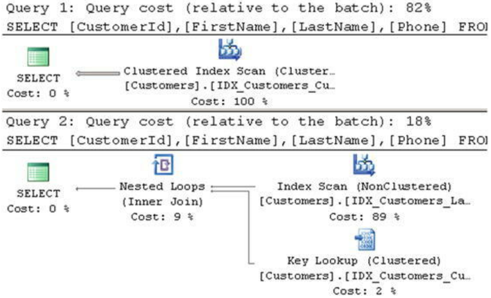

SQL Server decides to use a clustered index scan for the first select, which returns 700 rows, and a nonclustered index scan for the second select, which returns a single row.  
However, the histogram for the IDX_Customers_LastName_FirstName index stores the data distribution for the LastName column only, and SQL Server does not know about the FirstName data distribution.

> select  stats_id, name, auto_created from sys.stats where object_id = object_id(N'dbo.Customers')

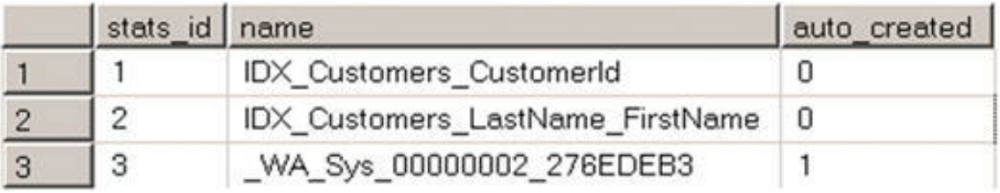

The last one, with the name that starts with the _WA prefix, displays column-level statistics, which were created automatically when SQL Server optimized our queries. SQL Server does not drop those column-level statistics automatically after they are created.

> DBCC SHOW_STATISTICS ('dbo.Customers', _WA_Sys_00000002_276EDEB3)

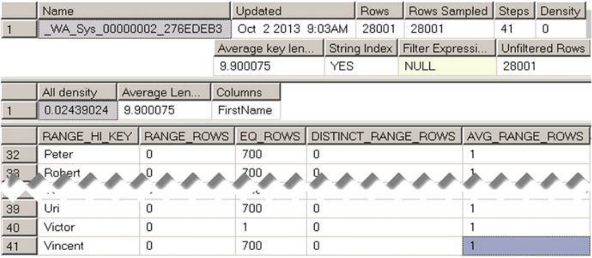

As a result, SQL Server can estimate the number of rows for first names, which we used as parameters, and generate different execution plans for each parameter value.

You can manually create statistics on a column or on multiple columns with the **CREATE STATISTICS** command. Statistics created on multiple columns are similar to statistics created on composite indexes. The histogram retains data distribution information ***for the leftmost column only.***

In some cases, ***when particular queries do not run very often***, you can elect to create column-level statistics rather than an index. Column-level statistics help Query Optimizer find better execution plans, even though those execution plans are suboptimal due to the index scans involved. At the same time, statistics do not add overhead during data modification operations, and they help you avoid index maintenance. This approach ***works only for rarely executed queries***.

## Statistics and Execution Plans

SQL Server creates and updates statistics automatically by default. There are two options on the database level that control such behavior:  
1. **Auto Create Statistics** controls whether or not the optimizer creates ***column-level*** statistics automatically, enabled by default.
2. **Auto Update Statistics** controls whether or not the SQL Server checks if statistics are outdated every time it compiles or executes a query and updates them if needed, enabled by default.

SQL Server determines if statistics are outdated based on the number of changes performed by the INSERT, UPDATE, DELETE, and MERGE statements that affect the statistics columns.

There are three different scenarios, called *statistics update thresholds*, also sometimes known as *statistics recompilation thresholds*, in which SQL Server marks statistics as outdated.
1. When a table is empty, SQL Server outdates statistics when you add data to the table.
2. When a table has less than 500 rows, SQL Server outdates statistics after every 500 changes of the statistics columns.
3. **Prior to SQL Server 2016 and in SQL Server 2016 with database compatibility level < 130:** When a table has 500 or more rows, SQL Server outdates statistics after every 500 + (20% of total number of rows in the table) changes of the statistics columns.
4. **In SQL Server 2016 with database compatibility level = 130:** Statistics update threshold on large tables becomes dynamic and depends on the size of the table. The more rows the table has, the lower the threshold is. On large tables with millions or even billions of rows, the statistics update threshold can be just a fraction of a percentage of the total number of rows in the table. This behavior can also be enabled with the trace flag T2371 in SQL Server 2008R2 SP1 and above.

Conclusion: with the static statistics update threshold, the number of changes to statistics columns required to trigger a statistics update is proportional to the table size. The larger the table, the less often statistics are automatically updated.

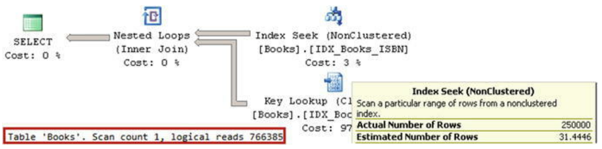
You will notice that there is a huge discrepancy between the estimated and actual number of rows for the Index Seek operator. SQL Server estimated that there are only 31.4 rows with prefix 999 in the table, even though there are 250,000 rows with such a prefix. As a result, a highly inefficient plan is generated.

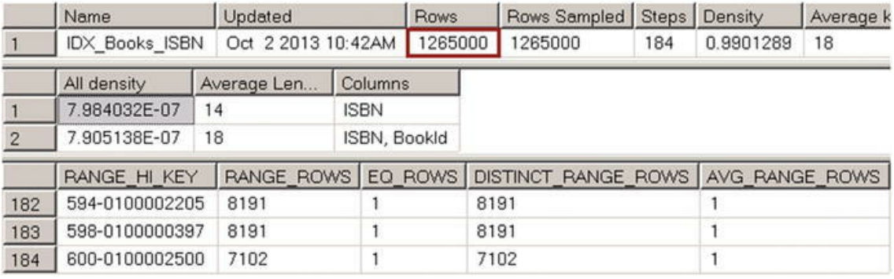
As you can see, there is no data in the histogram for the prefix 999.

Incorrect cardinality estimations can lead to highly inefficient execution plans. Outdated statistics are, perhaps, one of the most common reasons for incorrect cardinality estimations. You can pinpoint some of these cases by ***examining the estimated and actual number of rows in the execution plans***. A big discrepancy between these two values often indicates that statistics are incorrect. Updating statistics can solve this problem and generate more efficient execution plans.

## Statistics and Query Memory Grants

SQL Server tries to estimate the amount of memory (memory grant) required for a query and its operators based on row size and cardinality estimation. It is important that the memory grant is correct. Underestimations and overestimations both introduce inefficiencies.

Example table dbo.MemoryGrantDemo has 65,536 rows. The Col column stores values from 0 to 99, with either 655 or 656 rows per value. There is a nonclustered index on the Col column.  
Then add 656 new rows to the table, with Col=1000. This is just 1 percent of the total table data, and, as a result, the statistics are not going to be outdated. The histogram would not have any information about the Col=1000 value.

> select @Dummy = ID from dbo.MemoryGrantDemo where Col = 1 order by Placeholder;  
> select @Dummy = ID from dbo.MemoryGrantDemo where Col = 1000 order by Placeholder;

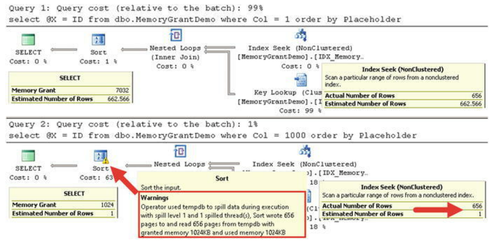

Even though the execution plans look very similar, the cardinality estimations and memory grants are different. Another difference is that the Sort operator icon in the second query has an exclamation mark. If you look at the operator properties, you will see a warning, which indicates that this operation spilled to tempdb. 

The execution time of the queries on my computer is as follows: 

*SQL Server Execution Times:*  
    *CPU time = 0 ms,  elapsed time = 17 ms.* 
    
*SQL Server Execution Times:*  
    *CPU time = 16 ms,  elapsed time = 88 ms.* 
    
As you can see, the second query with the incorrect memory grant and tempdb spill is about five times slower than the first one, which performs an in-memory sort.  

## Statistics Maintenance

SQL Server updates statistics automatically by default. However, you should not rely on automatic statistics updates in the case of large tables with millions or billions of rows unless you are using SQL Server 2016 with a database compatibility level of 130 or with trace flag T2371 enabled.  
The number of changes required in order to trigger a statistics update by the **20 percent statistics update threshold** would be very high, and, as a result, an update would not be triggered often enough.

It is recommended that you update statistics manually in that case. You must analyze the size of the table, data modification patterns, and system availability when picking an optimal statistics maintenance strategy.  
You can update statistics by using the **UPDATE STATISTICS** command. When SQL Server updates statistics, it reads a sample of the data rather than scanning the entire index. You can change that behavior by using the **FULLSCAN** option, which forces SQL Server to read and analyze all of the data from the index.

Another statistics-related database option is ***Auto Update Statistics Asynchronously***. By default, when SQL Server detects that statistics are outdated, it pauses query execution, synchronously updates statistics, and generates a new execution plan after the statistics update is complete.  
With an asynchronous statistics update, SQL Server executes the query using the old execution plan, which is based on outdated statistics, while updating statistics in the background asynchronously.  
It is recommended that you keep to the synchronous statistics update **unless the system has a very short query timeout, in which case a synchronous statistics update can timeout the queries**.  
Finally, SQL Server does not drop column-level statistics automatically when you create new indexes. You should drop redundant column-level statistics objects manually.

## New Cardinality Estimator (SQL Server 2014–2016)

The cardinality estimation model used in SQL Server 2005-2012 was initially developed for SQL Server 7.0 and released in 1998.

There are four major assumptions used in the model, including:  
***Uniformity***: This model assumes uniform data distribution in the absence of statistical information. For example, inside histogram steps, it is assumed that all key values are to be distributed evenly and uniformly.  
***Independence***: This model assumes that attributes in the entities are independent of each other. For example, when a query has several predicates against different columns of the same table, it assumes that the columns are not related in any way.  
***Simple Containment***: This model assumes that users query for the data that exists in the tables. For example, when you join two tables, in the absence of statistical information, the model assumes that all distinct values from one table exist in the other. The selectivity of the join operator in this model is based on the selectivity of the join predicates.
***Inclusion***: This model assumes that when an attribute is compared to a constant, there is always a match.

The new cardinality estimator uses a different code set that is much easier to support and has several different assumptions in the model, including:  
***Correlation***: The new model assumes a correlation between the predicates in the queries; this resembles more cases in real-life querying as compared to the Independence assumption model.  
***Base Containment***: This model assumes that users may query for data that does not exist in the tables. It factors the base table’s histograms into join operations in addition to the selectivity of join predicates.

### Comparing Cardinality Estimators: Up-to-Date Statistics

When the statistics are up to date, all models provide the same results.

Statistics:
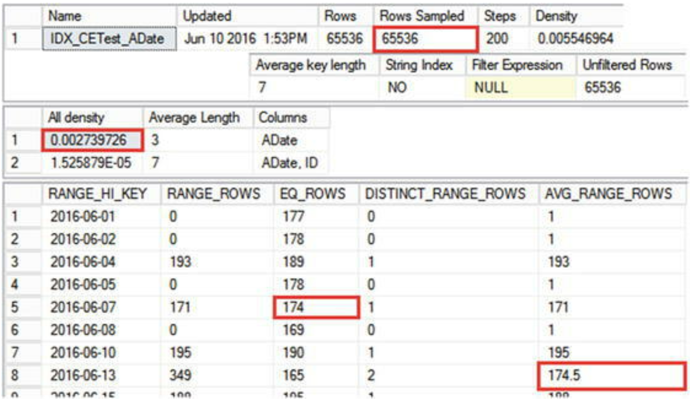
*IDX_CETest_AData statistics*

select ID, ADate, Placeholder from dbo.CETest with (index=IDX_CETest_ADate) where ADate = '2016-06-07';
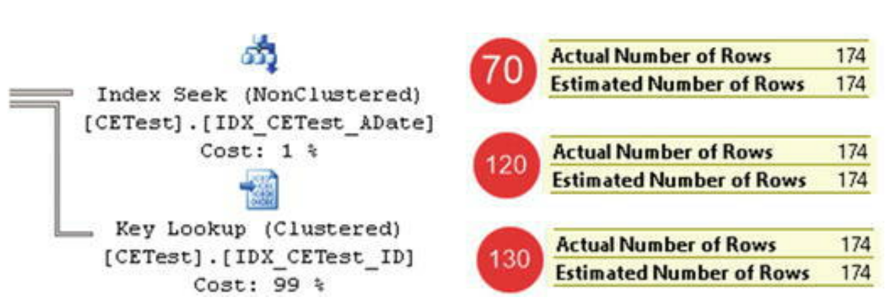
SQL Server uses a value from the EQ_ROWS column from the fifth histogram step for the estimation.

select ID, ADate, Placeholder from dbo.CETest with (index=IDX_CETest_ADate) where ADate = '2016-06-11';
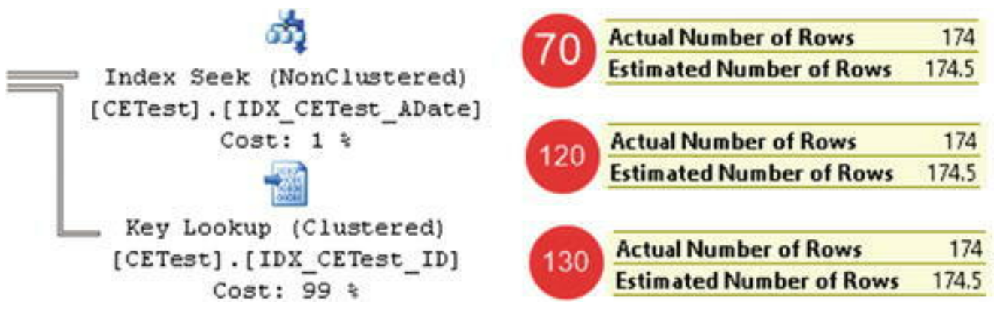
SQL Server uses the AVG_RANGE_ROWS column value from the eighth histogram step for the estimation.

declare @date DateTime = '2016-06-11'  
select ID, ADate, Placeholder from dbo.CETest with (index=IDX_CETest_ADate) where ADate = @date;
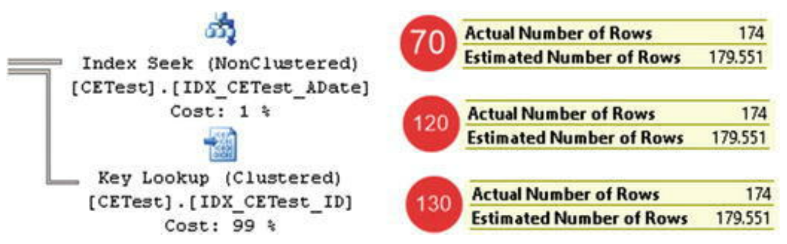
SQL Server uses average selectivity in the index and estimates the number of rows by multiplying the density of the key by the total number of rows in the index: 0.002739726 * 65536 = 179.551.

### Comparing Cardinality Estimators: Outdated Statistics

Unfortunately, in systems with non-static data, data modifications always outdate the statistics. Now insert 6,554 new rows in the table, which is 10 percent of the total number of rows, with auto_update_statistics disabled.

select ID, ADate, Placeholder from dbo.CETest with (index=IDX_CETest_ADate) where ADate = '2016-06-07';
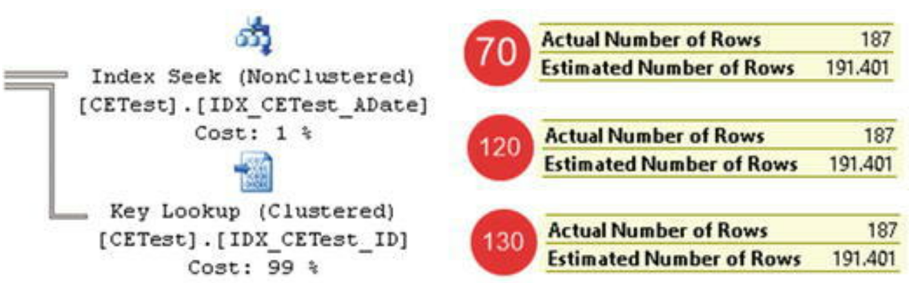
All models estimated 191.401 rows, which is 10 percent more than previously. SQL Server compares the number of rows in the table with the original Rows value in the statistics and adjusts the value from the EQ_ROWS column in the fifth histogram step accordingly.

select ID, ADate, Placeholder from dbo.CETest with (index=IDX_CETest_ADate) where ADate = '2016-06-11';
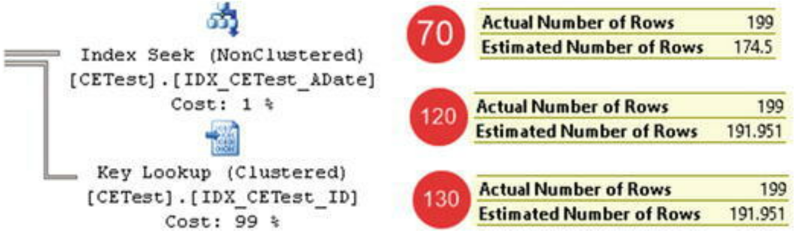
The new models take the 10 percent difference in the row count into consideration, similar to the previous example. The legacy 70 model, on the other hand, still uses the AVG_RANGE_ROWS value from the histogram step, even though the number of rows in the table does not match the number of rows kept in the statistics.

declare @date DateTime = '2016-06-11'  
select ID, ADate, Placeholder from dbo.CETest with (index=IDX_CETest_ADate) where ADate = @date;
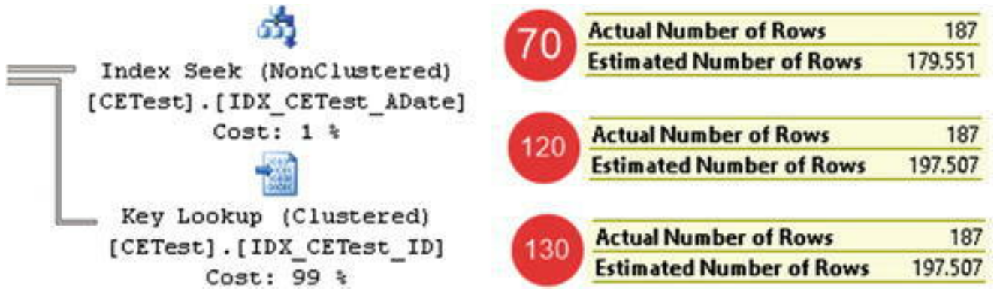
The new models adjust the estimation based on the row-count differences, while the legacy model ignores them.

Both approaches have their pros and cons. The new models produce better results when new data has been evenly distributed in the index. This is exactly what happened in our case when ADate values were randomly generated. Alternatively, the legacy model works better in cases of uneven distribution of new values when the distribution of old values did not change. You can think about ***indexes with ever-increasing key values as an example***.

### Comparing Cardinality Estimators: Indexes with Ever-Increasing Key Values

The next test compares the behavior of cardinality estimators when the value is outside of the histogram range. This often happens in cases of indexes with ever-increasing key values, such as those on ***the identity or sequence columns***.

the IDX_CETest_ID index. Index statistics were not updated after we inserted new rows.
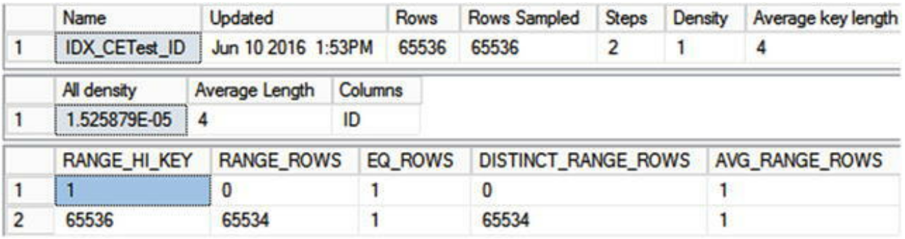
*Indexes with ever-increasing keys: Histogram*

select top 10 ID, ADate from dbo.CETest where ID between 66000 and 67000 order by PlaceHolder;
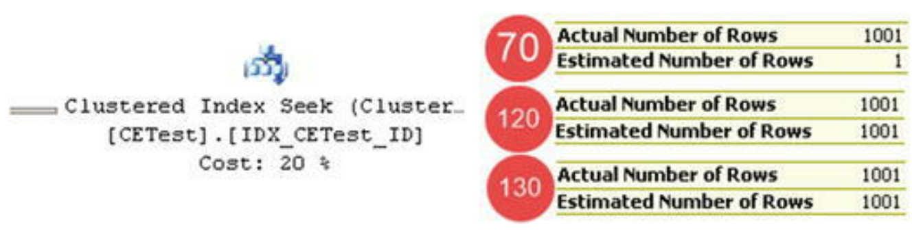
The legacy model estimated just the single row while the new models performed the estimation based on the average data distribution in the index. The new models provide better results and let you avoid frequent manual statistics updates for indexes with ever-increasing key values.

### Comparing Cardinality Estimators: Joins

Testing data:
> create table dbo.CETestRef  
> (  
>     ID int not null   
>     constraint FK_CTTestRef_CTTest foreign key references dbo.CETest(ID)  
> );  
> insert into dbo.CETestRef(ID) -- 72,090 rows select ID from dbo.CETest;  
> create unique clustered index IDX_CETestRef_ID on dbo.CETestRef(ID);

select d.ID from dbo.CETestRef d join dbo.CETest m on d.ID = m.ID
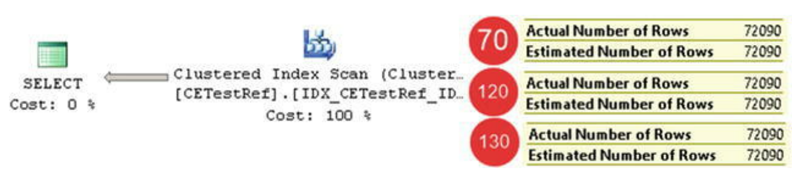
All models work the same, correctly estimating the number of rows.

select d.ID, ***m.ID*** from dbo.CETestRef d join dbo.CETest m on d.ID = m.ID
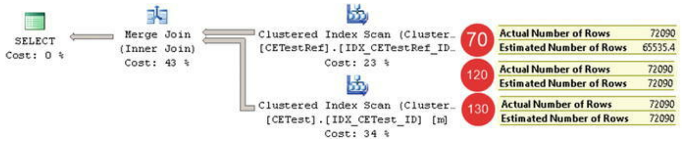
Even though a foreign key constraint guarantees that the number of rows in the result set will match the number of rows in the CETestRef table, the legacy cardinality estimator does not take it into consideration and therefore underestimates the number of rows. The new cardinality estimators do a better job, providing the correct result.

### Comparing Cardinality Estimators: Multiple Predicates

The new cardinality estimation model removes the Independence assumption, and it expects some level of correlation between entities’ attributes. It performs estimations differently when queries have multiple predicates that involve multiple columns in the table.

select ID, ADate from dbo.CETest where ID between 20000 and 30000 and ADate between '2017-01-01' and '2017-02-01';
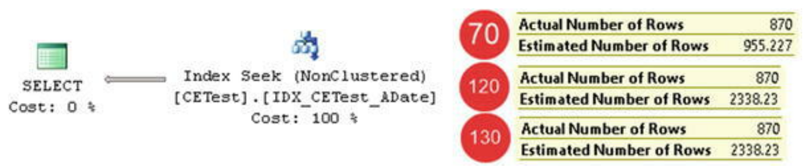
The legacy cardinality estimator assumes the independence of predicates and uses the following formula:  
(Selectivity of first predicate * Selectivity of second predicate) * (Total number of rows in table) = (Estimated number of rows for first predicate * Estimated number of rows for second predicate) / (Total number of rows in the table).

The new cardinality estimator expects some correlation between predicates, and it uses another approach called an exponential backoff algorithm, which is as follows:  
(Selectivity of most selective predicate) * SQRT(Selectivity of next most selective predicate) * (Total number of rows in table).

The legacy cardinality estimator works better when there is no correlation between attributes/predicates, as demonstrated in our example. The new cardinality estimator provides better results in cases of correlation.

### Choosing the Model

As a general rule, you should always choose the most recent model for a new development. Upgrades, on the other hand, are more complicated. Even though the new cardinality estimation model could provide better results in systems with modern workloads, there is always the possibility of performance regression resulting from the different execution plans. It is impossible to build a model that covers all possible workloads and data distributions, and you should carefully test the system after upgrading.

## Summary

Correct cardinality estimation is one of the most important factors that allows the Query Optimizer to generate efficient execution plans. Cardinality estimation affects the choice of indexes, join strategies, and other parameters.

SQL Server uses statistics to perform cardinality estimations. The vital part of statistics is the histogram, which stores information about data distribution in the leftmost statistics column. Every step in the histogram contains a sample statistics-column value and information about what happens in the histogram step, such as how many rows are in the interval, how many unique key values there are, and so on.

SQL Server creates statistics for every index defined in the system. In addition, you can create column-level statistics on individual or multiple columns in the table. SQL Server creates column-level statistics automatically if the database has the Auto Create Statistics option enabled.

Statistics have a few limitations. There are at most 200 steps (key value intervals) stored in the histogram. As a result, the histogram’s steps cover larger key value intervals as the table grows. This leads to larger approximations within the intervals and less accurate cardinality estimations on tables with millions or billions of rows. Moreover, the histogram stores information about data distribution for the leftmost statistics column only. There is no information about other columns in the statistics or index aside from multi-column density.

SQL Server tracks the number of changes made in statistics columns. By default, SQL Server outdates and updates statistics after that number exceeds about 20 percent of the total number of rows in the table. As a result, statistics are rarely updated automatically on large tables. You need to consider updating statistics on large tables manually based on a schedule.

In SQL Server 2016, with database compatibility level 130, the statistics update threshold is dynamic and based on the size of the table, which makes statistics on large tables more accurate. You can use trace flag T2371 in previous versions of SQL Server, or with database compatibility level lower than 130. It is recommended that you set this trace flag in the majority of systems.

The new cardinality estimation model is enabled in SQL Server 2014 and 2016 for databases with a compatibility level of 120 or 130. This model addresses a few common issues, such as estimations for ever-increasing indexes when statistics are not up to date; however, it may introduce plan regressions in some cases. You should carefully test existing systems before enabling the new cardinality estimation model after upgrading SQL Server.
