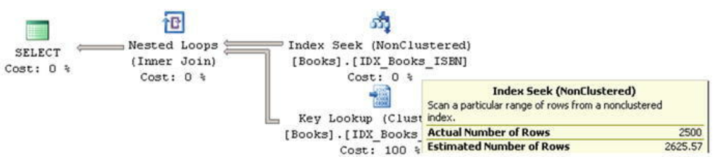

- [Data Storage Internals](#data-storage-internals)
  - [Introduction to SQL Server Statistics](#introduction-to-sql-server-statistics)

# Data Storage Internals

SQL Server Query Optimizer uses a cost-based model when choosing an execution plan for queries. It estimates the costs of the different execution plans and chooses the one with the lowest cost. However, that SQL Server d**oes not search for the best execution plan available for the query**, as evaluating all possible alternatives is time consuming and expensive in terms of the CPU. The goal of Query Optimizer is finding a good enough execution plan, fast enough.

Cardinality estimation (estimation of the number of rows that need to be processed at each step of query execution) is one of the most important factors in query optimization . This number affects the choice of join strategies, amount of memory (memory grant) required for query execution, and quite a few other things.

## Introduction to SQL Server Statistics

SQL Server statistics are system objects that contain information about data distribution in the index key values and, sometimes, in regular column values. Statistics can be created on any data type that supports comparison operations, such as >, <, =, and so on.

<!-- omit from toc -->
##### DBCC statement
DBCC SHOW_STATISTICS ('dbo.Books',IDX_BOOKS_ISBN)

As you can see, the DBCC SHOW_STATISTICS command returns three result sets. The first one contains general metadata information about the statistics, such as name, update date, number of rows in the index at the time when the statistics were updated, and so on. The Steps column in the first result set indicates the number of steps/values in the histogram (more about this later). The Density value is not used by Query Optimizer and is displayed for backward-compatibility purposes only.

The second result set, called density vector, contains information about density for the combination of key values from the statistics (index). It is calculated based on a 1 / number of distinct values formula, and it indicates how many rows, on average, each combination of key values has. Even though the IDX_Books_ISBN index has just one key column ISBN defined, it also includes a clustered index key as part of the index row. Our table has 1,252,500 unique ISBN values, and the density for the ISBN column is 1.0 / 1,252,500 = 7.984032E-07. All combinations of the (ISBN, BookId) columns are also unique and have the same density.

The last result set is called the histogram. Every record in the histogram, called a histogram step, includes the sample key value in the leftmost column of the statistics (index) and information about the data distribution in the range of values from the preceding to the current RANGE_HI_KEY value. Let’s examine histogram columns in greater depth.

- The RANGE_HI_KEY column stores the sample value of the key. This value is the upper-bound key value for the range defined by the histogram step. For example, record (step) #3 with RANGE_HI_KEY = '104-0100002488' in the histogram from Figure 3-1 stores information about the interval from ISBN > '101-0100001796' to ISBN <= '104-0100002488'. 
- The RANGE_ROWS column estimates the number of rows within the interval. In our case, the interval defined by record (step) #3 has 8,191 rows. 
- EQ_ROWS indicates how many rows have a key value equal to the RANGE_HI_KEY upper-bound value. In our case, there is only one row with ISBN = '104-0100002488'.
- DISTINCT_RANGE_ROWS indicates how many distinct values of the keys are within the interval. In our case, all of the values of the keys are unique, so DISTINCT_RANGE_ROWS = RANGE_ROWS. 
- AVG_RANGE_ROWS indicates the average number of rows per distinct key value in the interval. In our case, all of the values of the keys are unique, so AVG_RANGE_ROWS = 1.

SELECT BookId, Title FROM dbo.Books WHERE ISBN LIKE ‘114%’

***Actual Number of Rows*** indicates how many rows were processed during operator execution.  
***Estimated Number of Rows*** indicates the number of rows SQL Server estimated for that operator during the Query Optimization stage.  
In our case, SQL Server estimates that there are 2,625 rows with ISBNs starting with 114. If you look at the histogram shown in [DBCC SHOW_STATISTICS output](3.%20Statistics.md#dbcc-statement) you will see that step 10 stores the information about data distribution for the ISBN interval that includes the values that you are selecting. Even with linear approximation, you can estimate the number of rows to be close to what SQL Server determined.

There are two very important things to remember about statistics.
1. The histogram stores information about data distribution for the leftmost statistics (index) column only. There is information about the multi-column density of the key values in statistics, but that is it. All other information in the histogram relates to data distribution for the leftmost statistics column only. 
2. SQL Server retains at most 200 steps in the histogram, regardless of the size of the table and if the table is partitioned. The intervals covered by each histogram step increase as the table grows. This leads to less accurate statistics in the case of large tables.

In the case of composite indexes, when all columns from the index are used as predicates in all queries, **it is beneficial to define a column with lower density/higher percentage of unique values as the leftmost column of the index.** This will allow SQL Server to better utilize the data distribution information from the statistics.

