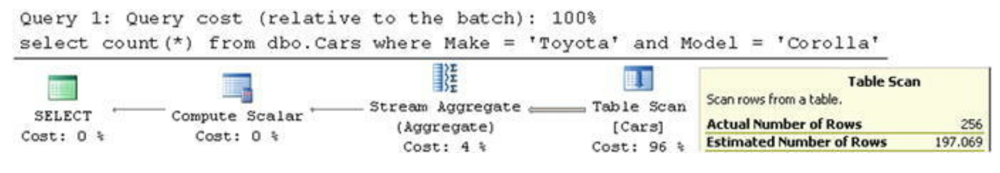

- [Special Indexing and Storage Features](#special-indexing-and-storage-features)
  - [Indexes with Included Columns](#indexes-with-included-columns)
  - [Filtered Indexes](#filtered-indexes)
  - [Filtered Statistics](#filtered-statistics)
  - [Calculated Columns](#calculated-columns)
  - [Data Compression](#data-compression)

# Special Indexing and Storage Features

## Indexes with Included Columns

SQL Server does not need to perform key or RID lookups when all of the data a query needs exists in a nonclustered index. Those indexes are called ***covering indexes*** as they provide all of the information that a query needs, and they are essentially covering the query.

SQL Server 2005 introduced a new way of making covering indexes by storing columns in the index without adding them to the index key. The data from these columns are stored on the leaf level only and do not affect the sorting order of the index rows.  
As a result, SQL Server does not need to move rows to different places in the index when included columns are modified.  
Included columns are not counted toward the 900/1,700 bytes index key size limit, and you can even store LOB columns if absolutely needed.

CREATE INDEX IDX_Customers_Name ON dbo.Customers (Name) INCLUDE (DateOfBirth) 

*Structure of an index with included columns*

select CustomerId, LastName, FirstName, Phone from dbo.Customers where LastName = 'Smith';  
select CustomerId, LastName, FirstName, Phone from dbo.Customers with (Index=IDX_Customers_LastName_FirstName) where LastName = 'Smith';

create nonclustered index IDX_Customers_LastName_FirstName_PhoneIncluded on dbo.Customers(LastName, FirstName) include(Phone);   
select CustomerId, LastName, FirstName, Phone from dbo.Customers where LastName = 'Smith';

Although covering indexes are a great tool that can help optimize queries, they come at a cost. Every column in the index increases its leaf-level row size and the number of data pages it uses on disk and in memory. That introduces additional overhead during index maintenance and increases the database size. Moreover, queries need to read more pages when scanning all or part of the index. Covering indexes do not necessarily introduce a noticeable performance impact during small range scans, when reading a few extra pages is far more efficient as compared to using key lookups. However, they could negatively affect the performance of queries that scan a large number of data pages or the entire index. 

By adding a column to nonclustered indexes, you store the data in multiple places. This improves the performance of queries that select the data. However, during updates, SQL Server needs to change the rows in every index where updated columns are present.

create index IDX_Key on dbo.Customers(LastName, FirstName);  
create index IDX_Include on dbo.Customers(LastName) include(FirstName);

select CustomerId, LastName, FirstName from dbo.Customers  with (index = IDX_Key) where LastName = 'Smith' and FirstName = 'Andrew';  
select CustomerId, LastName, FirstName from dbo.Customers  with (index = IDX_Include) where LastName = 'Smith' and FirstName = 'Andrew';

As you can see, it is better to add a column as the key column if you expect to use SARGable predicates against that column. Otherwise, it is better to add a column as an included column, make the non-leaf index levels smaller, and avoid the overhead of maintaining the sorting on extra columns.  

Finally, it is impossible to avoid mentioning the SELECT * pattern when we talk about covering indexes. SELECT * returns the data for all columns in the table, which essentially prevents you from creating covering indexes to optimize it. You should not use SELECT * in the code.

## Filtered Indexes

*Filtered indexes*, introduced in SQL Server 2008, allow you to index only a subset of the data. That reduces the index size and the maintenance overhead.

Consider a table with some data that needs to be processed. This table can have a Processed bit column, which indicates the row status.  
Let’s assume that you have a backend process that loads unprocessed data.  
This query can benefit from the following index: CREATE NONCLUSTERED INDEX IDX_Data_Processed_RecId ON dbo.Data(Processed, RecId).  
However, all index rows with a key value of Processed=1 would be useless. They will increase the index’s size, waste storage space, and introduce additional overhead during index maintenance.  

Filtered indexes solve that problem by allowing you to index just unprocessed rows, making the index small and efficient.  

create nonclustered index IDX_Data_Unprocessed_Filtered on dbo.Data(RecId) include(Processed) **where Processed = 0**;

Filtered indexes have a few limitations . Only simple filters are supported. You cannot use a logical OR operator, and you cannot reference functions and calculated columns.

Another important limitation of filtered indexes relates to plan caching. SQL Server could not use a filtered index when the execution plan needs to be cached and the index cannot be used with some combination of parameter values.

e.g. query below cannot use filtered index  
select top 1000 RecId, /* Other Columns */ from dbo.Data where Processed = @Processed order by RecId;

it needs to be modified to query below:  
if @Processed = 0  
    select top 1000 RecId, /* Other Columns */  
    from dbo.Data  
    where Processed = 0  
    order by RecId;  
else  
    select top 1000 RecId, /* Other Columns */  
    from dbo.Data  
    where Processed = 1  
    order by RecId;

Another very important aspect that you need to remember when dealing with filtered indexes is how SQL Server updates statistics on them.  
Unfortunately, SQL Server does not count the modifications of columns from the filter toward the statistics update threshold.  

This behavior can lead to incorrect cardinality estimation and suboptimal execution plans. You should regularly update statistics on filtered indexes when the filter columns are volatile and are not included in the index key. On the positive side, filtered indexes are usually small, and index maintenance introduces less overhead than with regular indexes.

Another area where filtered indexes are very useful is in supporting uniqueness on a subset of values.  
As a practical example, think about a table with SSN (Social Security Number) as the optional nullable column. This scenario usually requires you to maintain the uniqueness of the provided SSN values. You cannot use a unique nonclustered index for such a purpose, however. SQL Server treats NULL as the regular value and does not allow you to store more than one row with a non-specified SSN. Fortunately, a unique filtered index does the trick.

## Filtered Statistics

select count(*) from dbo.Cars where Make = 'Toyota';  
select count(*) from dbo.Cars where Model = 'Corolla';

SQL Server correctly estimates cardinality when you run queries with a single predicate.

SELECT COUNT(*) FROM dbo.Cars WHERE Make='Toyota' and Model='Corolla'

One solution to this problem is the use of filtered column-level statistics. These could improve cardinality estimation in the case of correlated predicates.  
create statistics stat_Cars_Toyota_Models on dbo.Cars(Model) where Make='Toyota'

The limitations of filtered statistics are similar to those of filtered indexes. SQL Server would not use this feature for cardinality estimation in the case of cached plans when there is the possibility that filtered statistics would not be applicable for all possible parameter choices. One of the cases where this happens is autoparameterization, which is when SQL Server replaces constant values in the WHERE clause of a query with parameters; that is, SQL Server would not use statistics if it autoparameterizes the predicate on the Model column in the preceding query. A statement-level recompile can help you to avoid such a situation. Moreover, SQL Server does not count the modifications of filter columns toward the statistics-modification threshold, which thus requires you to update statistics manually in some cases.

## Calculated Columns
SQL Server allows you to define calculated columns in a table using expressions or system and scalar user-defined functions.

create table dbo.Customers (  
    CustomerId int not null,  
    SSN char(11) not null,  
    Phone varchar(32) null,  
    **SSNLastFour as (right(SSN,4)),**  
    **PhoneAreaCode as (dbo.ExtractAreaCode(Phone)),**  
    /* Other Columns */  
);

SQL Server calculates the value of the calculated column when queries reference it. This can introduce some performance impact in the case of complex calculations, especially when a calculated column is referenced in the WHERE clause of a query.  
You can avoid this by making the calculated columns PERSISTED. In that case, SQL Server persists the calculated values, storing them in data rows similar to regular columns. While this approach improves the performance of queries that read data by removing any on-the-fly calculations, it reduces the performance of data modifications and increases the size of the rows.

create table dbo.PersistedColumn (  
    ID int not null,  
    PersistedColumn as (dbo.SameWithID(ID)) **persisted**  
);

Calculated columns that use **user-defined functions** prevent Query Optimizer from generating parallel execution plans even when queries do not reference them. This is one of the design limitations of Query Optimizer.  
It is worth mentioning that SQL Server is able to generate parallel execution plans for tables with calculated columns, as long as they are not calculated with user-defined functions.

You can create indexes on calculated columns even when those columns are not persisted. This is a great option when the main use case for a calculated column is to support index seek operations. One such example is searching by the last four digits in an SSN. You can create a nonclustered index on the SSNLastFour calculated column in the dbo.Customers table without making the calculated column persisted. Such an approach saves storage space for data.

It is important to decide where to calculate data. Even though calculated columns are convenient for developers, they add load to SQL Server during calculations. This decision is even more important in cases where applications use ORM frameworks and load calculated columns as attributes of the entities. This scenario increases the chance that calculated columns will be referenced and calculated, even when they are not needed for some of the use cases.  

You also need to remember that a typical system includes multiple application servers with only one active database server serving all of the data. It is usually simpler and cheaper to scale out application servers than it is to upgrade the database server.  

Calculating data at the application server or client level reduces the load on SQL Server. However, if the system does not have dedicated data-access and/or business-logic tiers, it could lead to supportability issues when a calculation needs to be done in multiple places in the code. As usual, the decision falls into the “It Depends” category, and you need to evaluate the pros and cons of every approach.

## Data Compression
